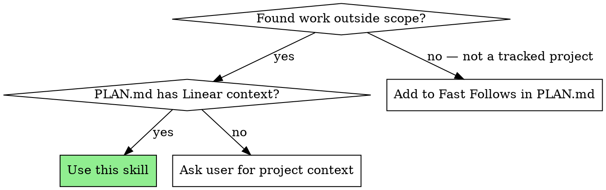

# Linear Issues: Record Work Items from Context

You are helping a developer capture discovered work items — fast follows, unrelated bugs, and follow-ups — as Linear issues, linked to the correct project and labeled appropriately.

**Violating the letter of the rules is violating the spirit of the rules.**

## The Iron Law

```
EVERY DISCOVERED WORK ITEM GETS A TICKET — NOT A COMMENT, NOT A TODO, NOT "WE'LL REMEMBER"
```

If you found something that needs doing but isn't in scope, it's a Linear issue. Period.

## Common Rationalizations

| Excuse | Reality |
|--------|---------|
| "I'll just add a TODO comment" | TODOs rot. Issues get triaged. Create the ticket. |
| "It's too small for a ticket" | Small items compound. Track them or lose them. |
| "The user will remember" | No they won't. That's what issue trackers are for. |
| "I don't know which project to file it under" | Read PLAN.md — the project is right there. Ask if unclear. |
| "I'll batch these at the end" | Accumulate in PLAN.md as you find them. File to Linear with user approval. |
| "This is related enough to include in this PR" | Related ≠ in scope. Separate ticket, separate PR. |

## Red Flags — STOP

- Discovering work items without adding them to PLAN.md's Fast Follows table
- Filing Linear issues without explicit user approval
- Adding "while we're here" work instead of recording it
- Leaving TODO comments as a substitute for Fast Follow entries
- Filing issues without checking PLAN.md for project context

## When to Use



## Prerequisites

- Linear API token at `~/.config/linear/token`
- PLAN.md exists and contains project/ticket context (e.g., `> PAS-567: Feature Title` or `Project: Tips Rolled Out To Compass`)

## Process

### Step 1: Accumulate in PLAN.md (Always)

As you discover work items, **immediately** add them to PLAN.md's Fast Follows table. This happens continuously — don't wait for a batch.

```markdown
## Fast Follows (Future PRs)
| ID | Item | Type | Rationale | Discovered During |
|----|------|------|-----------|-------------------|
| FF-001 | Auth error on expired tokens | bug | Unrelated to current feature | Phase 5 implementation |
| FF-002 | Add rate limiting to notifications | follow-up | Needs this feature first | Phase 1 exploration |
| FF-003 | Clean up dead notification code | tech-debt | Found during code-explorer trace | Phase 1 exploration |
```

Items live here as the source of truth. Filing to Linear is a separate step that requires user approval.

### Step 2: Request User Approval to File

**Do NOT create Linear issues automatically.** Present the accumulated items to the user:

> "I've accumulated N work items in PLAN.md's Fast Follows table during this session:
> - FF-001: Auth error on expired tokens (bug)
> - FF-002: Add rate limiting (follow-up)
>
> Want me to file these as Linear issues? Say **'file all'**, **'file FF-001'**, or **'skip'**."

The user may:
- Approve all → file everything
- Approve specific items → file only those
- Skip → items stay in PLAN.md only
- Edit → user changes title/classification before filing

### Step 3: Extract Context from PLAN.md

Read PLAN.md and extract:
- **Project name** (from `Project:` line or inferred from ticket prefix)
- **Parent ticket** (from `> PAS-XXX:` line if present)
- **Labels** (from `Labels:` line if present)
- **Current branch** for cross-referencing

### Step 4: Classify the Work Item

| Type | When | Linear Fields |
|------|------|---------------|
| **Fast Follow** | Planned but deferred from current scope | Priority: Low, Label: `fast-follow` |
| **Bug** | Unrelated defect discovered during work | Priority: Medium+, Label: `bug` |
| **Follow-up** | Depends on current work shipping first | Priority: Normal, Label: `follow-up`, blocked by parent |
| **Tech Debt** | Code quality issue not blocking functionality | Priority: Low, Label: `tech-debt` |

### Step 5: Create the Issue (User-Approved Only)

Use the Linear GraphQL API to create the issue:

```bash
# Extract team ID and project ID from cached Linear data
LINEAR_TOKEN=$(cat ~/.config/linear/token)
LINEAR_CACHE="$HOME/panop/.wip-linear"

# Create issue via GraphQL
curl -s -X POST https://api.linear.app/graphql \
  -H "Content-Type: application/json" \
  -H "Authorization: $LINEAR_TOKEN" \
  -d '{
    "query": "mutation($input: IssueCreateInput!) { issueCreate(input: $input) { success issue { identifier url } } }",
    "variables": {
      "input": {
        "teamId": "<team-id>",
        "projectId": "<project-id>",
        "title": "<title>",
        "description": "<description with context>",
        "priority": <1-4>,
        "labelIds": ["<label-id>"]
      }
    }
  }'
```

### Step 6: Link Back

After creating:
1. Add the new issue identifier to PLAN.md's Fast Follows table
2. Note the relationship (e.g., "Discovered during PAS-567 implementation")
3. If the issue blocks or is blocked by current work, set the relation in Linear

### Step 7: Report

```markdown
Created: PAS-XXX — [title]
  Project: [project name]
  Type: [fast-follow | bug | follow-up | tech-debt]
  URL: [linear url]
  Linked to: [parent ticket if applicable]
```

## Batch Mode

When multiple items are discovered at once (e.g., during scope-guardian audit or code review):

1. Collect all items with classification
2. Present to user for review before filing
3. Create all issues
4. Update PLAN.md Fast Follows table with all new identifiers

## API Reference

### Find Team ID
```graphql
{ teams { nodes { id name } } }
```

### Find Project ID
```graphql
{ projects(filter: { name: { contains: "PROJECT_NAME" } }) { nodes { id name } } }
```

### Find Label IDs
```graphql
{ issueLabels(filter: { name: { in: ["bug", "fast-follow"] } }) { nodes { id name } } }
```

### Create Issue
```graphql
mutation($input: IssueCreateInput!) {
  issueCreate(input: $input) {
    success
    issue { identifier url title }
  }
}
```

## Integration with Other Skills

This skill is invoked FROM other workflows:

- **feature-collab Phase 1**: When scope-guardian identifies out-of-scope items → file as fast follows
- **feature-collab Phase 5**: When code-architect discovers bugs → file as bugs
- **bugfix Phase 1**: When investigation reveals related issues → file as follow-ups
- **enhance**: When scope creep is detected → file the extra work as separate tickets

The orchestrator should invoke this skill (or its agent) whenever discovered work would otherwise be lost.
