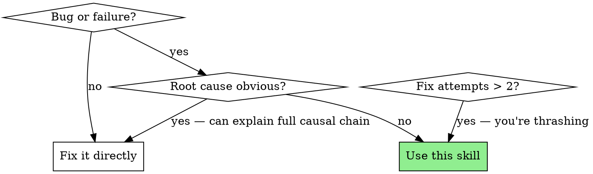

# Systematic Debugging: Root Cause Before Fix

A rigorous four-phase debugging methodology. Find the root cause FIRST, then fix. No exceptions.

**Violating the letter of the rules is violating the spirit of the rules.**

## The Iron Law

```
NO FIX WITHOUT ROOT CAUSE INVESTIGATION FIRST
```

Random patches waste time and mask underlying problems. This is true regardless of time pressure or issue complexity.

## Common Rationalizations

| Excuse | Reality |
|--------|---------|
| "Let me just try changing X and see if it works" | That's guessing, not debugging. Investigate first. |
| "One more fix attempt, I can feel it" | You felt that two attempts ago. Return to Phase 1. |
| "I know what the problem is" | Then you can explain the full causal chain. If not, investigate. |
| "This is an emergency, no time for investigation" | Systematic debugging is FASTER than guess-and-check thrashing. |
| "I'll investigate after I try this quick fix" | Quick fixes become permanent mysteries. Investigate now. |
| "The error message tells me exactly what to fix" | Error messages describe symptoms, not causes. Trace the cause. |
| "It worked when I tested it manually" | Manual testing is anecdote, not evidence. Write a failing test. |
| "I'll write the test after I fix it" | Tests-after prove nothing. Tests-first prove the bug exists. TDD RED first. |
| "The fix is obvious, I don't need a test" | If it's obvious, the test takes 30 seconds. Write it. |
| "I'll just add a quick assertion to an existing test" | If the existing test didn't catch this bug, it's not testing the right thing. Write a new test. |

## Red Flags — STOP and Return to Phase 1

- "Just try changing X and see if it works"
- "One more fix attempt" (after 2+ failures)
- Adding code without understanding why existing code fails
- Fixing a symptom without explaining the causal chain
- 3+ fix attempts without returning to investigation

**All of these mean: STOP. Go back to Phase 1. You are thrashing.**

## When to Use



## Phase 1: Root Cause Investigation (TDD RED)

**Goal**: Understand WHY the failure occurs AND capture it as a failing test.

**TDD RED is the foundation.** Before you investigate, before you hypothesize, before you touch ANY production code — write a test that fails. This test IS your reproduction. If you can't write a failing test, you don't understand the bug well enough to fix it.

### Actions

1. **Read the error carefully** — full stack trace, not just the message
2. **Write a failing test IMMEDIATELY** — this is your reproduction step. The test should:
   - Trigger the exact failure the user reported
   - Assert the CORRECT behavior (what should happen)
   - FAIL with an error message that clearly shows the bug
   - This test is your contract: the bug is fixed when this test goes green

   ```markdown
   ### Reproduction Test
   **File**: [test file path]
   **Test name**: "should [expected behavior] when [condition]"
   **Current result**: FAILS — [actual error]
   **Expected result**: PASSES when bug is fixed
   ```

   If you cannot write a failing test yet, that's fine — but you MUST write it before leaving Phase 1. The investigation below helps you understand enough to write it.

3. **Review recent changes** — what changed between "working" and "broken"?
4. **Gather diagnostic evidence** across system boundaries:

```markdown
## Diagnostic Evidence

### Error
[Full error message and stack trace]

### Reproduction
[Exact command/test that triggers the failure]

### Recent Changes
[What changed — git log, recent commits, config changes]

### System State
[Relevant state — DB contents, env vars, service status, logs]
```

5. **For multi-component systems**: Instrument each layer to identify exactly where the failure occurs

```markdown
### Layer Analysis
| Layer | Input | Output | Status |
|-------|-------|--------|--------|
| Route handler | Request body | → Service call | OK |
| Service | Service params | → Repository call | FAILS HERE |
| Repository | Query params | → DB result | Not reached |
```

### Exit Gate
Phase 1 is complete when BOTH are true:
1. You have a **failing test** that reproduces the bug (TDD RED)
2. You can answer: **"The failure occurs because [specific mechanism], triggered by [specific condition]."**

If you don't have a failing test, you're not done with Phase 1. If you can't explain the mechanism, keep investigating.

## Phase 2: Pattern Analysis

**Goal**: Understand the pattern — why does the working code work and the broken code break?

### Actions

1. **Find a working example** — similar code that succeeds
2. **Compare working vs broken** — what's different?
3. **List all assumptions** the broken code makes
4. **Verify each assumption** — which one is wrong?

```markdown
### Pattern Comparison
| Aspect | Working Code | Broken Code | Different? |
|--------|-------------|-------------|------------|
| Input format | ISO date string | Unix timestamp | YES — root cause? |
| Error handling | Try-catch | None | YES — masks real error |
| Dependencies | v2.3 | v2.4 | YES — breaking change? |
```

### Exit Gate
You can explain the specific assumption that's violated and why.

## Phase 3: Hypothesis & Test

**Goal**: Form a specific, testable hypothesis and validate it minimally.

### The Scientific Method

1. **Hypothesis**: "The failure occurs because [X]. If I change [Y], the failure should [Z]."
2. **Minimal test**: Change ONLY the variable in your hypothesis
3. **Observe**: Did the result match your prediction?
4. **Adjust**: If not, update hypothesis — don't add more changes

```markdown
### Hypothesis Log
| # | Hypothesis | Test | Result | Conclusion |
|---|-----------|------|--------|------------|
| 1 | Timezone offset causes date mismatch | Force UTC in test | Still fails | Not timezone |
| 2 | Date parsing treats input as local time | Log parsed date | Parsed as UTC midnight | CONFIRMED |
| 3 | UTC midnight falls on previous local day | Compare with TZ-aware parse | Dates differ by 1 day | ROOT CAUSE |
```

### Critical Rule
**One variable at a time.** If you change two things and it works, you don't know which one fixed it.

### Exit Gate
Your hypothesis predicted the result correctly. You understand the causal chain.

## Phase 4: Implementation (TDD GREEN)

**Goal**: Make the failing test from Phase 1 go GREEN with a single, targeted fix.

Your failing test already exists from Phase 1. Now make it pass.

### Actions

1. **Confirm the test is still RED** — run it right now to prove the bug still exists
2. **Implement a single fix** — address the root cause, not the symptom
3. **Run the test** — it should go GREEN. If not, your hypothesis is wrong → return to Phase 3
4. **Run the full test suite** — no regressions
5. **Explain**: Document why this fix addresses the root cause

```markdown
### Fix Summary
- **Root Cause**: [one sentence]
- **Fix**: [one sentence]
- **Why This Works**: [explain the causal connection]
- **Test**: [test name that proves the fix]
```

### Escalation Rule

**If 3+ fixes fail in Phase 4**: STOP. The root cause analysis is wrong. Return to Phase 1 and question the underlying architecture. You may be fixing symptoms of a deeper problem.

## Integration with bugfix Skill

This methodology is embedded in the bugfix workflow:

- **bugfix Phase 1** uses Phases 1-2 of this skill (investigation + pattern analysis)
- **bugfix Phase 2** uses Phases 3-4 of this skill (hypothesis + implementation)

When the bugfix skill's code-explorer agent investigates, it should follow this systematic methodology rather than guessing at fixes.

## Quick Reference

| Phase | TDD State | Question to Answer | Exit When |
|-------|-----------|-------------------|-----------|
| 1. Investigate | **RED** | WHY does it fail? | Failing test written + can explain mechanism |
| 2. Pattern | RED | What assumption is wrong? | Can point to the violated assumption |
| 3. Hypothesis | RED | What single change fixes it? | Prediction matches observation |
| 4. Implement | **GREEN** | Does the fix hold? | Failing test passes, no regressions |

## The Bottom Line

Systematic debugging is FASTER than guess-and-check, even under time pressure. Every minute spent investigating saves ten minutes of thrashing. If you're on fix attempt #3 without a root cause, you're not debugging — you're gambling.
