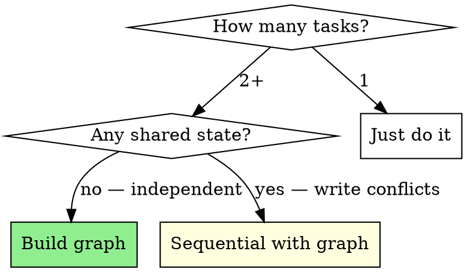
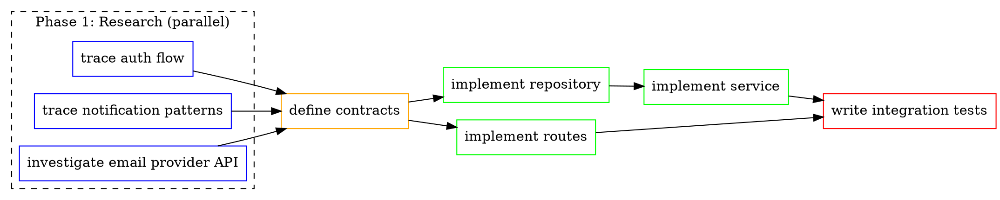
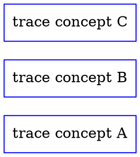

# Work Graph: Dependency Analysis & Parallel Dispatch

You are building a directed acyclic graph (DAG) of work items to identify what can run in parallel and what has sequential dependencies. This graph drives agent dispatch strategy.

**Violating the letter of the rules is violating the spirit of the rules.**

## The Iron Law

```
NO PARALLEL DISPATCH WITHOUT A DEPENDENCY GRAPH — NO SEQUENTIAL EXECUTION WITHOUT PROVING DEPENDENCY
```

If tasks are independent, they MUST run in parallel. If they're dependent, the graph must show why.

## Common Rationalizations

| Excuse | Reality |
|--------|---------|
| "I'll just do them one at a time" | Sequential execution of independent tasks wastes time. Graph it. |
| "They're probably related" | "Probably" isn't a dependency. Prove it or parallelize. |
| "It's easier to reason about sequentially" | Easier for you ≠ faster for the user. Graph the dependencies. |
| "There are only 2-3 tasks" | Even 2 independent tasks benefit from parallel dispatch. |
| "I'll figure out ordering as I go" | That's how you end up blocked waiting on something you could have started earlier. |
| "The tasks share some files" | Shared files ≠ dependency. Do they write to the same lines? Graph it. |

## Red Flags — STOP

- Running tasks sequentially without checking for independence
- Claiming tasks are dependent without identifying the specific dependency
- Dispatching agents without a graph when there are 3+ tasks
- Skipping the graph because "it's obvious"

## When to Build a Work Graph



## Graph Notation

Use DOT digraph notation in PLAN.md. Every node is a task, every edge is a dependency.



### Node Colors

| Color | Meaning |
|-------|---------|
| `blue` | Research / exploration (code-explorer) |
| `orange` | Contract / design (orchestrator) |
| `green` | Implementation (code-architect) |
| `red` | Verification (test-runner, criteria-assessor) |
| `purple` | Review (code-reviewer, code-security) |

### Dependency Types

Label edges to clarify the dependency:

```dot
"implement service" -> "implement routes" [label="imports types"];
"write tests" -> "implement service" [label="needs interface"];
"research API" -> "define contracts" [label="informs design"];
```

## Process

### Step 1: Extract Tasks

From PLAN.md's Tasks section or the current phase's work items, list every discrete task.

### Step 2: Identify Dependencies

For each pair of tasks, ask:
1. Does task B need task A's **output** (a file, a type, a decision)?
2. Does task B need to **read** something task A **writes**?
3. Could task B start right now if task A didn't exist?

If (3) is yes → no dependency. Tasks are independent.

### Step 3: Build the Graph

Write the DOT digraph into PLAN.md's Tasks section. Group independent tasks in `subgraph cluster_*` blocks to make parallelism visually obvious.

### Step 4: Identify Parallel Groups

Tasks with no incoming edges (or whose dependencies are all complete) can run NOW. These become parallel agent dispatches.

```markdown
## Dispatch Plan

### Wave 1 (parallel)
- Agent: code-explorer → "trace auth flow"
- Agent: code-explorer → "trace notification patterns"
- Agent: code-explorer → "investigate email provider API"

### Wave 2 (after Wave 1)
- Orchestrator: define contracts (synthesize Wave 1 findings)

### Wave 3 (parallel where possible)
- Agent: code-architect → "implement repository"
- Agent: code-architect → "implement routes" (independent of repo)

### Wave 4 (after Wave 3)
- Agent: code-architect → "implement service" (needs repo)
- Agent: test-runner → "run integration tests"
```

### Step 5: Execute Waves

Dispatch each wave's agents in parallel. When all agents in a wave complete, advance to the next wave.

## Wave Execution Protocol

When dispatching agents wave-by-wave:

1. **Launch all agents in the current wave simultaneously** — use parallel tool calls
2. **Wait for ALL agents in the wave to complete** before starting the next wave
3. **Check outputs against contracts** — if an agent's output doesn't satisfy its downstream dependency, fix before proceeding
4. **Update PLAN.md** with wave completion status after each wave

### Failure Handling

| Scenario | Action |
|----------|--------|
| Agent fails in a wave | Re-run that agent only. Other wave results are still valid. |
| Agent output doesn't match contract | Fix the output before starting dependent waves. |
| Deadlock detected (circular dependency) | DOT parser should have caught this. Re-analyze the graph. |
| Wave takes too long (>10 min per agent) | Check if agent is stuck. Kill and re-dispatch with more specific instructions. |

## Integration with feature-collab Phases

### Phase 1 (Discovery)
Build a research graph. Concept-tracing tasks are almost always independent → parallel code-explorer agents.



### Phase 4 (Architecture)
Build an implementation graph from the Tasks section. This becomes the execution plan for Phase 5.

### Phase 5 (Implementation)
Execute the graph wave by wave. Update node status as tasks complete:

```dot
"implement repository" [color=green, style=filled, fillcolor=lightgreen, label="implement repository\n✓ DONE"];
```

### Other Skills (bugfix, enhance, spike)
Even simpler workflows benefit from graphing when there are parallel research tasks. A bugfix with 3 possible root causes → 3 parallel investigation agents.

## Agent Dispatch Pattern

Each wave dispatches agents with:
1. **Specific scope**: One task from the graph
2. **Clear goal**: What this task produces
3. **Constraints**: Don't touch files outside your task's scope
4. **Dependencies delivered**: Output from prior waves that this task needs

```markdown
Implement the notification repository layer.

**Input** (from prior wave):
- CONTRACTS.md defines NotificationDelivery type
- Test file: notification.repository.test.ts (must make these pass)

**Scope**:
- Create src/repositories/notification.repository.ts
- Implement CRUD methods matching contract signatures

**Do NOT**: Modify service layer, routes, or other repositories.

**Return**: Summary of what was implemented + any issues found.
```

## Verification After Parallel Dispatch

When agents return from parallel execution:
1. **Check for conflicts** — Did agents modify the same files?
2. **Run test-runner** — Verify combined changes work together
3. **Update graph** — Mark completed nodes, identify next wave
4. **Scope check** — Did any agent drift outside their task boundary?

## Quick Reference

| Graph Element | Meaning |
|---------------|---------|
| Node | A discrete task |
| Edge | Dependency (must complete before) |
| No edges | Fully independent → parallelize |
| Cluster | Group of related parallel tasks |
| Node color | Task type (blue=research, green=impl, red=verify) |
| Filled node | Task complete |
